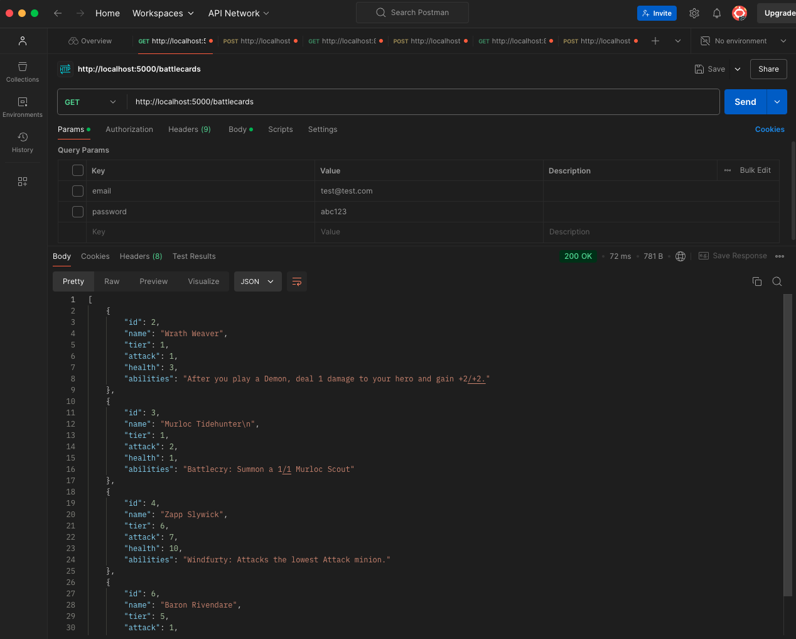
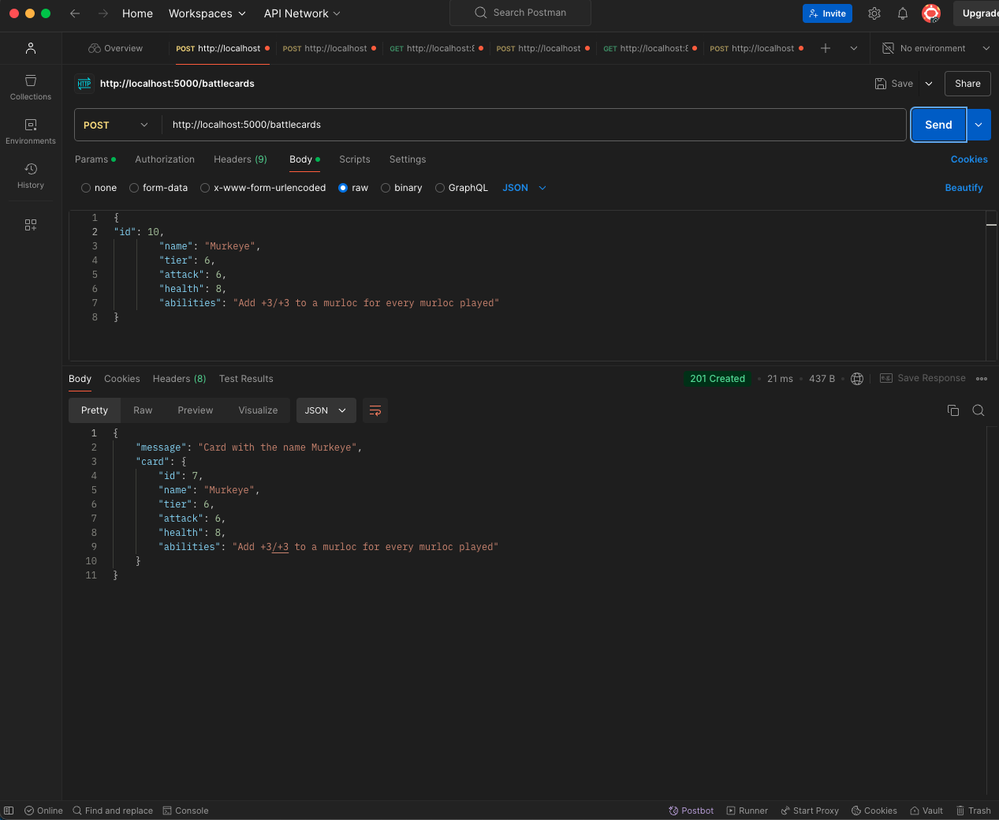
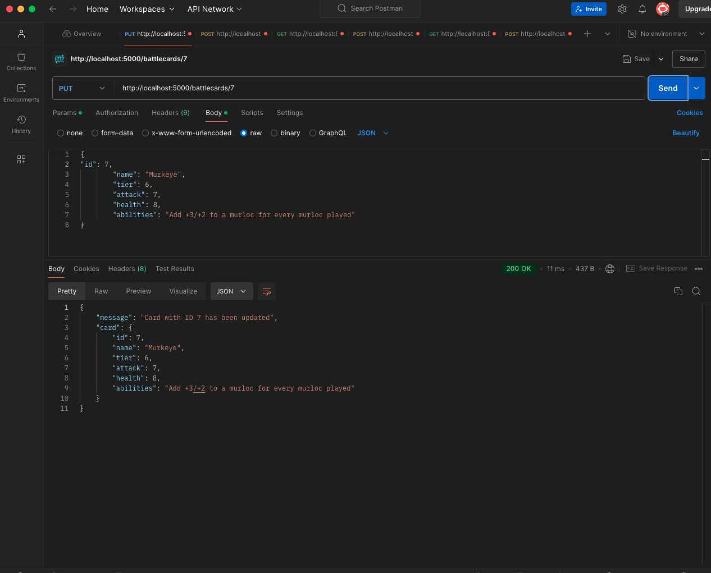
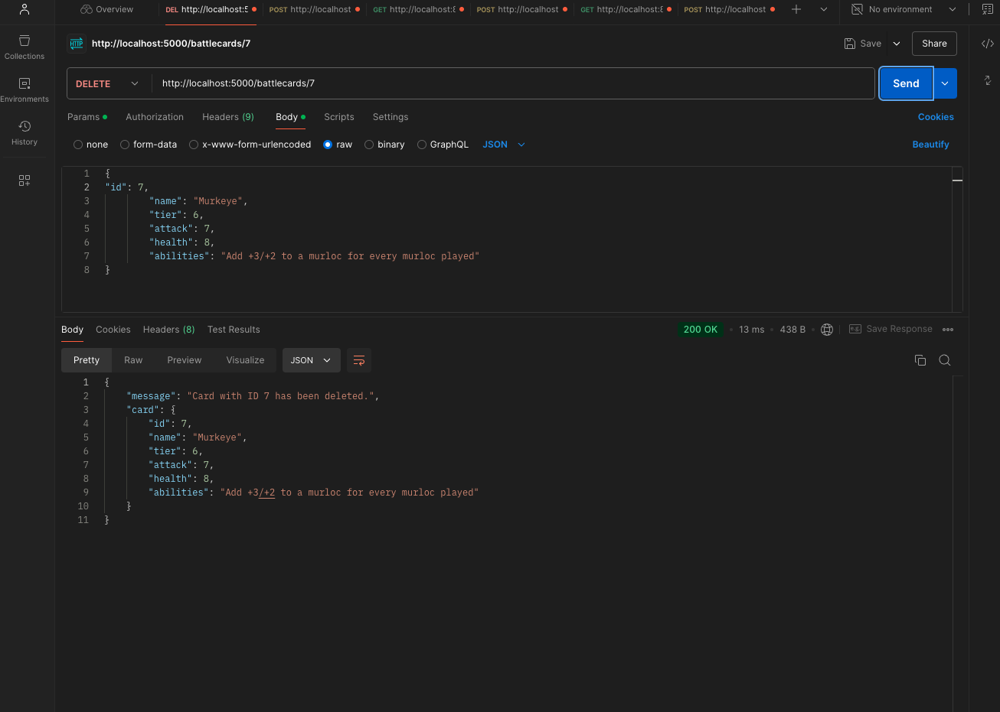

# Battlecards API

This project is a RESTful API for managing battlecards in a game-like environment. The API is built using Node.js, Express, and PostgreSQL, and allows you to perform CRUD operations on battlecards, such as retrieving, creating, updating, and deleting records.

## Features

- **Create a Battlecard**: Add new battlecards to the database.
- **Retrieve All Battlecards**: Fetch a list of all battlecards stored in the database.
- **Update a Battlecard**: Update battlecards with new versions. 
- **Delete a Battlecard**: Remove a battlecard from the database by its ID.

## Technologies Used

- **Node.js**: JavaScript runtime for building the server-side application.
- **Express.js**: Web framework for creating the RESTful API.
- **PostgreSQL**: Relational database for storing battlecard data.
- **pg**: PostgreSQL client for Node.js, used to interact with the database.

## Prerequisites

Before you begin, ensure you have the following installed on your machine:

- **Node.js** (v12 or higher)
- **PostgreSQL** (v9.6 or higher)

## Setup Instructions

### 1. Clone the Repository

### 2. Install Dependencies

npm install

### 3. Set Up Environment Variables

Create a `.env` file in the root of the project with the following:

DB_USER=your_db_username
DB_PASSWORD=your_db_password
DB_HOST=localhost
DB_PORT=5432
DB_NAME=battlegrounds_db

Replace `DB_USER` `DB_PASSWORD` and `battlgrounds_db` with your PostgreSQL credentials. 

### 4. Set up PostgreSQL Database

Connect to PostgreSQL:

psql -U your_db_username

Create database: 

CREATE DATABASE battlegrounds_db;
\c battlegrounds_db;

Create table for database:

CREATE TABLE battlegrounds_cards (
    id SERIAL PRIMARY KEY,
    name VARCHAR(255) NOT NULL,
    tier INT NOT NULL,
    attack INT NOT NULL,
    health INT NOT NULL,
    abilities VARCHAR(255)
);

### 5. Start the Server

npm run server

The server will start on `http://localhost:5000`

## API Endpoints

### 1. GET/battlecards

Retrieve all battlecards.
Response: JSON array of battlecards. 



### 2. POST/battlecards

Create new battlecard with request body example:

````python
{
    "name": "New Card",
    "tier": 1,
    "attack": 3,
    "health": 2,
    "abilities": ["Some Ability"]
}
````

Response: JSON object of the created battlecard. 




### 3. PUT/battlecards

Replace existing battle card with new version using example JSON object above.
Response: JSON object of the update battlecard.  


### 4. DELETE/battlecards

Delete battlecard by it's ID.
Response: Message confirming deletion. 



## Error Handling

Returns HTTP status codes and error messages in case of invalid input or server errors. 

## Future Plans

### Adding Client-Side Application

The plan is to develop a client side application that will interact with this API. The frontend application will provide user-friendly interface for interactind with the battlecards. Planned features include: 

- **Battlecards Display**
- **Create Custom Battlecard**
- **Edit Existind Battlecards**
- **Search and Filter through Battlecards**
